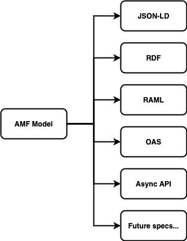

Emission is useful for exporting an AMF model to a specific desired format.
Any AMF model can be emitted as JSON-LD or RDF, which are standard graph representations of the model.
In the case of the WebApi model in particular, it can also be exported to RAML, OAS, AsyncAPI and all the API specifications to be incorporated in the future:

These emissions have some limitations, as some things are specification-specific and cannot be represented in others.
You can find more technical information in the related documentation.
