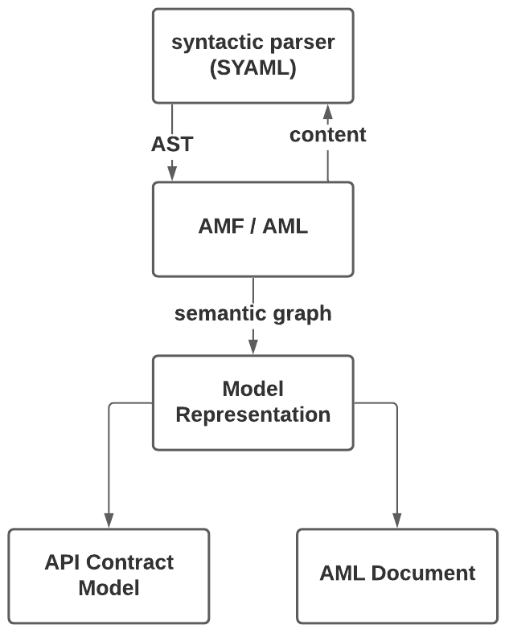

AMF can parse [**AML dialects**](https://aml-org.github.io/aml-spec/dialects) and the following API specifications:

- [**RAML 0.8**](https://github.com/raml-org/raml-spec/blob/master/versions/raml-08/raml-08.md)
- [**RAML 1.0**](https://github.com/raml-org/raml-spec/blob/master/versions/raml-10/raml-10.md)
- [**OAS 2.0**](https://github.com/OAI/OpenAPI-Specification/blob/master/versions/2.0.md)
- [**OAS 3.0**](https://github.com/OAI/OpenAPI-Specification/blob/master/versions/3.0.3.md)
- [**AsyncAPI 2.0**](https://github.com/asyncapi/asyncapi/blob/master/versions/2.0.0/asyncapi.md)

The following section explains the basics of parsing, and the example shows how to parse each specification in Java or JavaScript.

## Parsing Basics
Parsing is the process of analyzing a sequence of tokens and then building a data structure from them.

AMF uses [SYAML](https://github.com/aml-org/syaml) to read a JSON or YAML file and generates an [**abstract syntax tree**](https://en.wikipedia.org/wiki/Abstract_syntax_tree) (AST)
from the file, which is later used to generate a graph that represents the model.
The model can be either a Web API model (representing an API, independent of its specification), or an AML document model (a dialect, vocabulary, or dialect instance).

Parsing returns a [BaseUnit](https://github.com/aml-org/amf/blob/develop/documentation/model.md#baseunit) object, which is a graph of the model.
Depending on the content in the parsed file, the BaseUnit object can be a [Fragment](https://github.com/aml-org/amf/blob/develop/documentation/model.md#fragment), a [Module](https://github.com/aml-org/amf/blob/develop/documentation/model.md#module),
a [Document](https://github.com/aml-org/amf/blob/develop/documentation/model.md#document) or another type.

For more information about the AMF model, see the [AMF model documentation](model.mdx) resource.

The following figure shows the parsing process:

- SYAML is used to generate an AST from a YAML/JSON file
- AMF uses the AST to generate a graph of the model, called BaseUnit
    - This model will be used in the following stages of AMF (resolution, validation, emission)

## Parsing code examples
The file paths you give the parser must have the following structure:

Windows:
- Absolute path: `file:///C:/testing/api.raml`
- Relative path: `file://api.raml`

MacOS and Unix:
- Absolute path: `file:///Users/aml/testing/api.raml`
- Relative path: `file://api.raml`

Also, before parsing an AML dialect instance, you must register the dialect using the `AMF.registerDialect()` function.

import Tabs from '@theme/Tabs';
import TabItem from '@theme/TabItem';
import CodeGetter from "../../../components/CodeGetter";

<Tabs
    groupId="languages"
    defaultValue="java"
    values={[
        {label: 'Java', value: 'java'},
        {label: 'JavaScript', value: 'js'}
    ]}
>

<TabItem value="java">
    <CodeGetter
        language='java'
        example='java/ParsingTest.java'
    />
</TabItem>
<TabItem value="js">
    <CodeGetter
        language='js'
        example='js/parsing.test.js'
    />
</TabItem>
</Tabs>

