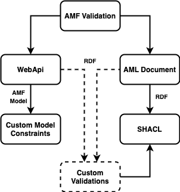

Validation is the process of checking that your model complies with the constraints you've defined for it.
If the model doesn't comply, you can determine where it's invalid and assess the severity.

After you've parsed and resolved the model, apply AMF validation:
- **Web API validations**
    - These are programmatic constraints that are validated against the WebApi model
    - There are general validations and validations specific to every API specification AMF supports
- **SHACL validations**
    - [SHACL](https://www.w3.org/TR/shacl) (Shapes Constraint Language) declares certain conditions that can be
    validated against [RDF graphs](https://en.wikipedia.org/wiki/Resource_Description_Framework), such as the AMF Graph
    - Used mainly to validate AML dialect instances

The following figure explains the AMF validation process:

## Validation Examples
import Tabs from '@theme/Tabs';
import TabItem from '@theme/TabItem';
import CodeGetter from "../../../components/CodeGetter";

<Tabs
    groupId="languages"
    defaultValue="java"
    values={[
        {label: 'Java', value: 'java'},
        {label: 'JavaScript', value: 'js'}
    ]}
>

<TabItem value="java">
    <CodeGetter
        language='java'
        codeUrl='examples/new-doc/src/test/java/ValidationTest.java'
    />
</TabItem>
<TabItem value="js">
    <CodeGetter
        language='js'
        codeUrl='examples/new-doc/src/test/js/validation.test.js'
    />
</TabItem>
</Tabs>

The final feature in the AMF repertoire is emission, and you'll learn about it in the next section.
