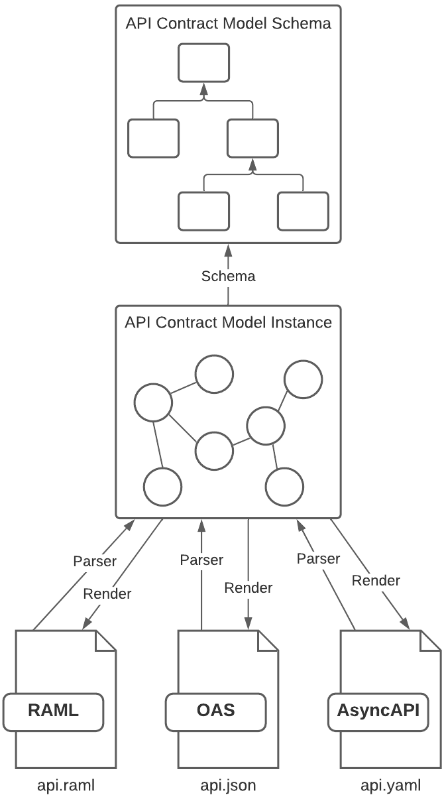

:::info
If you're coming from AMF version 4.x.x and already use AMF, see the
[Migration Guide to version 5](amf/migration_guide).
:::

## What is AMF?
[AMF](https://github.com/aml-org/amf) (AML Modeling Framework) is a powerful open-source library capable of parsing,
transforming, validating and rendering arbitrary models, with out-of-the-box features for API models.
Works with [RAML](https://raml.org/), [OAS](https://github.com/OAI/OpenAPI-Specification) (formerly Swagger),
and [AsyncAPI](https://github.com/asyncapi/asyncapi) API specification languages.
Custom models are defined with AML [AML](https://aml-org.github.io/aml-spec) Vocabularies and Dialects.

If you want to know more about AMF and all its features, visit the [What is AMF](amf/what_is_amf) page.

## How does it work?

export const myStyle = {
    padding: "15px 5px",
};

<div className="container">
<div className='row'>
<div style={myStyle} className='col col--6'>



</div>
<div style={myStyle} className='col col--6'>

AMF provides out-of-the-box a model and parsers for API specs, called the **API Contract Model**.

This model contains all information expressed in the source API document, so you can perform validations, transformations,
and even convert the API from one specification to another. The model can also be rendered in JSON-LD, you can learn more
about the API Contract Model [here](amf/using-amf/amf_model).

> You can also define your own custom model and parsers using the [AML language](aml/aml).

</div>
</div>
</div>

For example, consider the following OAS 3.0 API:

```yaml title="Sample API in OAS 3.0"
openapi: 3.0.0
info:
  title: Sample API
  description: Optional multiline or single-line description.
  version: 0.1.9
servers:
  - url: http://api.example.com/v1
paths:
  /users:
    get:
      responses:
        '200':
          description: A JSON array of user names
          content:
            application/json:
              schema:
                type: array
                items:
                  type: string
```

The following code shows how AMF can **parse** the OAS 3.0 API (generating an instance of the API Contract Model), **validate** the API is correct,
**transform** it (requires compatibility pipeline), and **render** the same API in RAML 1.0.

import Tabs from '@theme/Tabs';
import TabItem from '@theme/TabItem';

<Tabs
    groupId="languages"
    defaultValue="scala"
    values={[
        {label: 'Scala', value: 'scala'},
        {label: 'Java', value: 'java'},
        {label: 'TypeScript', value: 'ts'}
    ]}
>

<TabItem value="scala">

```scala
val raml10Client: AMFBaseUnitClient = RAMLConfiguration.RAML10().baseUnitClient()
val oas30Client: AMFBaseUnitClient = OASConfiguration.OAS30().baseUnitClient()
oas30Client.parse("file://path/to/api.yaml") map { parseResult =>
  oas30Client.validate(parseResult.baseUnit) map { validationReport =>
    println("report.conforms == " + validationReport.conforms)
    val transformResult = raml10Client.transform(parseResult.baseUnit, PipelineId.Compatibility)
    val renderResult = raml10Client.render(transformResult.baseUnit)
  }
}
```

</TabItem>
<TabItem value="java">

```java
AMFBaseUnitClient oas30Client = OASConfiguration.OAS30().baseUnitClient();
AMFBaseUnitClient raml10Client = RAMLConfiguration.RAML10().baseUnitClient();
BaseUnit oasApi = oas30Client.parse("file://path/to/api.yaml").get().baseUnit();
AMFValidationReport validationReport = oas30Client.validate(oasApi).get();
System.out.println("report.conforms() == " + validationReport.conforms());
BaseUnit convertedRaml = raml10Client.transform(ramlApi, PipelineId.Compatibility()).baseUnit();
String result = raml10Client.render(convertedRaml).trim();
```

</TabItem>
<TabItem value="ts">

```ts
let oas30Client = OASConfiguration.OAS30().baseUnitClient();
let raml10Client = RAMLConfiguration.RAML10().baseUnitClient();
let parseResult: AMFDocumentResult = await oas30Client.parseDocument("file://path/to/api.yaml");
let validationReport: AMFValidationReport = await client.validate(parseResult.document);
console.log("report.conforms = ", validationReport.conforms)
let transformResult: AMFResult = await raml10Client.transform(parseResult.baseUnit, PipelineId.Compatibility);
let rendered: string = raml10Client.render(transformResult.baseUnit, "application/yaml");
```

</TabItem>
</Tabs>

Resulting in the following API:
```yaml title="Sample API parsed, validated, transformed, and rendered in RAML 1.0"
#%RAML 1.0
title: Sample API
baseUri: http://api.example.com/v1
description: Optional multiline or single-line description.
version: 0.1.9
/users:
  get:
    responses:
      "200":
        description: A JSON array of user names
        body:
          application/json:
            type: array
            items:
              type: string
```

## More resources
This is a simplified introduction to the AML Modeling Framework. Continue learning about AMF in the following docs:
- For more information about how each AMF operation works, visit the [Using AMF](amf/using-amf/amf_setup) documentation.
- If you want to know more about AML, the power behind AMF, visit the [AML section](aml/aml).
- If you're looking for specific use cases or code examples, consider the [Cookbook section](cookbook/code_snippets).
