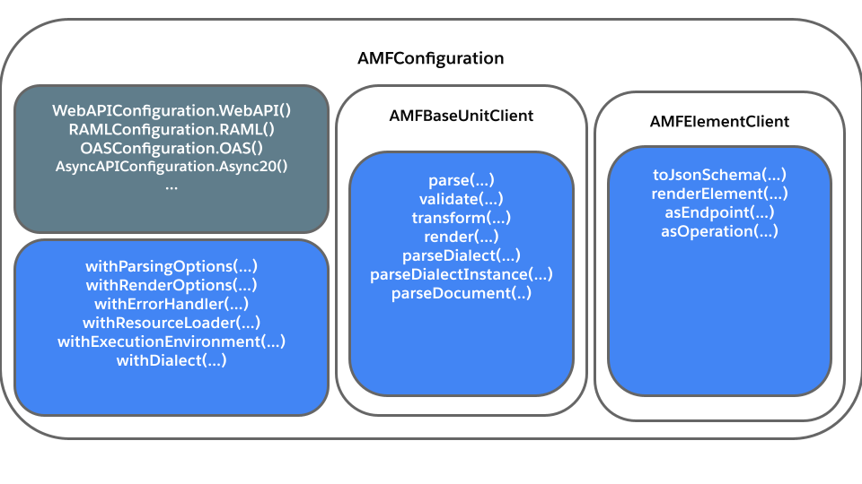

# Main differences between AMF 4 and AMF 5
The main purpose behind AMF 5 is to make AMF easier to use, modular, composable, and simpler to understand.

To achieve this we made the following changes:
- AMF has been reorganized into separate modules
- Changes in the state of the program are now more explicit and transparent
  - Removed static code and introduced immutable objects, builders, fluent interfaces and more
  - Unified configuration logic like options, plugins, environments, etc. in a single configuration object
- Client interface has been simplified and redesigned for better modularity

Let's go through the details of each new improvement:


### No initialization required in AMF 5
To use AMF 4 you have to call the `AMF.init()` method which has no room for customization and what it does exactly is obscure.
Moreover, you still have to create and configure each operation handler you want. For example, to transform a
RAML 1.0 API to an OAS 2.0 you still have to create and configure a `Raml10Parser`, `Oas20Resolver`, and `Oas20Renderer` object:

Not surprisingly, most of the issues reported to us from AMF 4 were caused by our static operations, which were difficult to reproduce and debug.
Because of this, AMF 5 removed static initialization and static operations, replacing them with a customizable configuration object and clients objects
that hold all operations available. More information in the [Unified client interface](#unified-client-interface) section.

### Unified client interface
All AMF operations were previously dispersed across multiple classes, having to create and call multiple objects
to do the most common AMF operations. The AMF 4 client interface looked something like this:


---

In AMF 5 initialization is not required, and operations like `parse()`, `transform()`, `validate()`, `render()` are all
under the [AMF Configuration and Client](amf/using-amf/amf_configuration) objects.

Furthermore, each operation provides its own feedback. Previously in AMF 4 you had to validate an API to check
for parsing errors, while in AMF 5 the parsing operation returns its own results.



The following code snippet is a transformation of an API from RAML 1.0 to OAS 2.0 that illustrates the differences between interfaces:

export const myStyle = {
    padding: "15px 5px",
};

<div className="container">
<div className='row'>
<div style={myStyle} className='col col--6'>

```java title="AMF 4 initialization"
AMF.init().get();
final Raml10Parser parser = new Raml10Parser();
final Oas20Resolver resolver = new Oas20Resolver();
final Oas20Renderer renderer = new Oas20Renderer();
final BaseUnit ramlApi = parser.parseFileAsync("file://path/to/api.raml").get();
final BaseUnit convertedOasApi = resolver.resolve(ramlApi, ResolutionPipeline.COMPATIBILITY_PIPELINE());
final String result = renderer.generateString(convertedOasApi).get().trim();
```

</div>
<div style={myStyle} className='col col--6'>

```java title="AMF 5 configuration"
AMFBaseUnitClient oas20Client = OASConfiguration.OAS20().baseUnitClient();
AMFBaseUnitClient raml10Client = RAMLConfiguration.RAML10().baseUnitClient();
final BaseUnit ramlApi = raml10Client.parse("file://path/to/api.raml").get().baseUnit();
final BaseUnit convertedOas = oas20Client.transform(ramlApi, PipelineId.Compatibility()).baseUnit();
final String result = oas20Client.render(convertedOas).trim();
```

</div>
</div>
</div>
