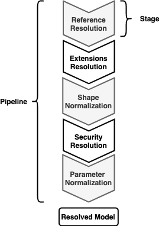

'Transformation' is the process of applying incremental transformations to the AMF Graph model.
AMF provides several 'transformation pipelines'. The base pipeline comprises the following stages:

Transformation allows you to flatten and simplify the AMF graph model by:
- Resolving links and inheritances
- Applying RAML traits and resourceTypes
- Normalization of shapes and parameters

You'll also find these pipelines are important when converting from one API specification to another.
For example, when converting a RAML API to OAS the 'Compatibility' pipeline makes changes to the WebApi model to have a valid, OAS-compliant API.

## Pipelines
Depending on your needs, you can use one of the following AMF provided transformation pipelines:

- **Default**
    - Keeps only the parsed graph model and deletes all information no longer relevant, such as `document.declares`
- **Editing**
    - Keeps all information in already parsed nodes, such as the source and the declarations
    - Use when someone is editing the API, such as an interactive API designer that uses AMF in the background
- **Compatibility**
    - **Must** be used when converting an API to a different specification
    - Includes additional AMF-specific information to aid in specification conversion

You may also implement your own pipelines.

## Examples
import Tabs from '@theme/Tabs';
import TabItem from '@theme/TabItem';
import CodeGetter from "/components/CodeGetter";

<Tabs
    groupId="languages"
    defaultValue="java"
    values={[
        {label: 'Java', value: 'java'},
        {label: 'Typescript', value: 'ts'}
    ]}
>

<TabItem value="java">
    <CodeGetter
        AMFVersion='v5'
        language='java'
        example='TransformationTest.java'
    />
</TabItem>
<TabItem value="ts">
    <CodeGetter
        AMFVersion='v5'
        language='ts'
        example='transformation.spec.ts'
    />
</TabItem>
</Tabs>
