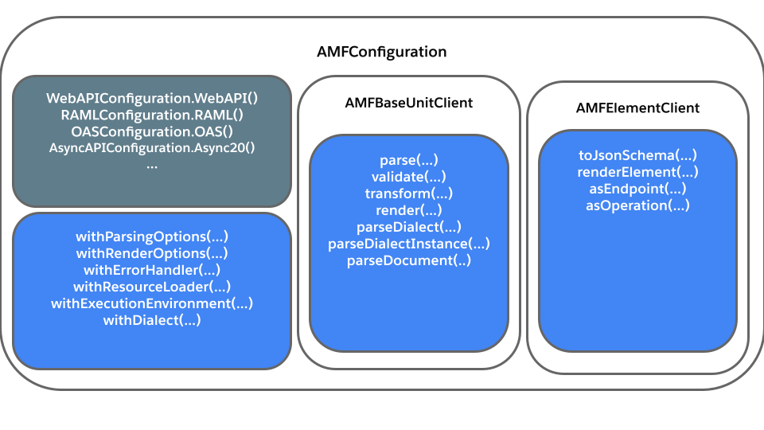

To use AMF you need an `AMFConfiguration` object.
This immutable object stores and configures:
- Parsing options
- Render options
- Resource loaders
- Plugins
- Transformation pipelines
- Validation profiles
- Error handler providers
- Event Listeners
- And more ...

The [AMF configuration](#amf-configuration) object provides an [AMF Client](#amf-client) that you'll use to interact with AMF.

## AMF Configuration


## Configuration types
The `AMFConfiguration` class has a builder style setup so that you can create a configuration according to your project needs.
AMF already provides specific and general configurations.

### Specific configurations
AMF has predefined configurations for each specification it supports:
- **`RAMLConfiguration`**
    - `RAMLConfiguration.RAML08()` for RAML 0.8 documents
    - `RAMLConfiguration.RAML10()` for RAML 1.0 documents
- **`OASConfiguration`**
    - `OASConfiguration.OAS20()` for OAS 2.0 documents
    - `OASConfiguration.OAS30()` for OAS 3.0 documents
- **`AsyncAPIConfiguration`**
    - `AsyncAPIConfiguration.Async20()` for AsyncAPI 2.0.0 documents

Each configuration has all it needs to parse, transform, validate and render documents.

### General configurations
AMF also has general-purpose configurations that support spec-agnostic parsing.
This enables parsing without knowing the exact specification of a document, but all other operations
(transformation, validation, rendering) are spec-dependent and require a specific configuration.
These general-purpose configurations are:
- **`RAMLConfiguration.RAML()`** can parse both RAML 0.8 and RAML 1.0 documents
- **`OASConfiguration.OAS()`** can parse both OAS 2.0 and OAS 3.0 documents
- **`WebAPIConfiguration.WebAPI()`** can parse RAML and OAS documents
- **`APIConfiguration.API()`** can parse RAML, OAS and AsyncAPI documents

The `AMFParseResult` returned by parsing contains the exact specification parsed in the property `.sourceSpec`, and each configuration
has the method `.fromSpec(Spec)` that returns the specific [specific configuration](#specific-configurations) for the spec provided,
so it's simple to use a general-purpose configuration and then use it to get the specific configuration needed.


## AMF Client
To interact with AMF you need to create a client from a configuration.
There are 2 types of clients in AMF, depending on what you want to work with:
- `baseUnitClient`
    - Contains common AMF operations to operate with `BaseUnit`
      - A `BaseUnit` is the model used by AMF to store parsed documents
    - Contains methods like `parse(url)`, `parseContent(string)`, `transform(BaseUnit)`, `render(BaseUnit)`, `validate(BaseUnit)`, etc.
- `elementClient`
    - Contains functionality associated with specific elements of the AMF graph model, not documents.
    - Contains methods like `getPayloadValidatorFor(shape, mediatype, mode)`, `toJsonSchema(element)`, `toRamlDatatype(element)`

The following code is an example of creating a configuration, a client, and using AMF:

import Tabs from '@theme/Tabs';
import TabItem from '@theme/TabItem';

<Tabs
    groupId="languages"
    defaultValue="java"
    values={[
        {label: 'Scala', value: 'scala'},
        {label: 'Java', value: 'java'},
        {label: 'TypeScript', value: 'ts'}
    ]}
>

<TabItem value="scala">

```scala
import amf.apicontract.client.scala.RAMLConfiguration

val configuration = RAMLConfiguration.RAML10()
val client = configuration.baseUnitClient()
// your code...
```

</TabItem>
<TabItem value="java">

```java
import amf.apicontract.client.platform.OASConfiguration;
import amf.apicontract.client.platform.AMFBaseUnitClient;

class App {
    public static void main(String[] args){
        final AMFConfiguration configuration = OASConfiguration.OAS30();
        final AMFBaseUnitClient client = configuration.baseUnitClient();
        // your code...
    }
}
```

</TabItem>
<TabItem value="ts">

```typescript
import {
  AMFBaseUnitClient,
  AMFConfiguration,
  OASConfiguration,
} from "amf-client-js";

const configuration: AMFConfiguration = OASConfiguration.OAS20()
const client: AMFBaseUnitClient = configuration.client
// ... your code
```

</TabItem>
</Tabs>
