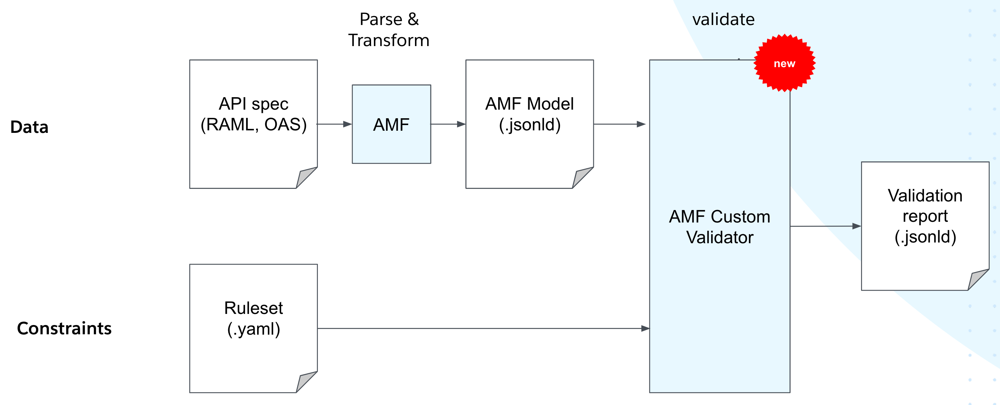

The Custom Validation feature is **no longer a part of the AMF core** as from version 5.x.x onwards. It has beed extracted and rebumped to a new project called the [AMF Custom Validator](https://github.com/aml-org/amf-custom-validator).

Just like any other validator, the AMF Custom Validator takes two inputs: data and contraints. Specifically, it takes the **AMF JSON-LD output** as **data** and a **Ruleset** (former *Validation Profile*) as **contraints** and returns a **validation report**.

## Using the AMF Custom Validator

To get started with the AMF Custom Validator refer to the [README file](https://github.com/aml-org/amf-custom-validator/blob/develop/README.md) in the project repo

To write a Ruleset, please refer to the:
* [Validation tutorial](https://github.com/aml-org/amf-custom-validator/blob/develop/docs/validation_tutorial/validation.md) in the project repository to understand the Ruleset syntax and validation
* The [AMF Model](/docs/amf/using-amf/amf_model) section to understand the JSON-LD data input

