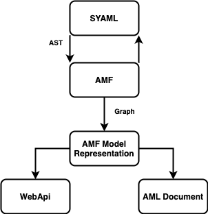

AMF can parse [AML dialects](https://aml-org.github.io/aml-spec/dialects), [JSON Schema](https://json-schema.org/) ([check supported drafts](/docs/related-docs/json_schema_document)), and the following API specifications:

- [RAML 0.8](https://github.com/raml-org/raml-spec/blob/master/versions/raml-08/raml-08.md)
- [RAML 1.0](https://github.com/raml-org/raml-spec/blob/master/versions/raml-10/raml-10.md)
- [OAS 2.0](https://github.com/OAI/OpenAPI-Specification/blob/master/versions/2.0.md)
- [OAS 3.0](https://github.com/OAI/OpenAPI-Specification/blob/master/versions/3.0.3.md)
- [AsyncAPI 2.0](https://github.com/asyncapi/spec/blob/2.0.0/versions/2.0.0/asyncapi.md)

The following section explains the basics of parsing, and the example shows how to parse each specification in Scala, Java or Typescript.

## Parsing Basics
Parsing is the process of analyzing a sequence of tokens and then building a data structure from them.

AMF uses syntactic parsers such as [SYAML](https://github.com/aml-org/syaml) to read a JSON or YAML file and generates
an [abstract syntax tree](https://en.wikipedia.org/wiki/Abstract_syntax_tree) (AST) from the file,
which is later used to generate a [semantic graph](https://en.wikipedia.org/wiki/Abstract_semantic_graph) that represents the model.
This model can be either an [API Contract Model](amf_model) (representing an API, independent of its specification),
or an AML Document model (a `Dialect`, `Vocabulary`, or `Dialect Instance`).

Parsing returns a [BaseUnit](https://github.com/aml-org/amf/blob/develop/documentation/model.md#baseunit) object, which is a graph of the model.
Depending on the content in the parsed file, the BaseUnit object can be a [Fragment](https://github.com/aml-org/amf/blob/develop/documentation/model.md#fragment),
a [Module](https://github.com/aml-org/amf/blob/develop/documentation/model.md#module),
a [Document](https://github.com/aml-org/amf/blob/develop/documentation/model.md#document) or another type.

The following figure shows the parsing process:

export const myStyle = {
    padding: "15px 5px",
};

A syntactic parser such as SYAML is used to generate an AST from a YAML/JSON file or a string.

AMF uses the AST to generate a semantic graph of the model, called `BaseUnit`.
This `BaseUnit` will be used in the following stages of AMF
([transformation](amf_transformation), [validation](amf_validation), [rendering](amf_rendering)).

> For more information about the AMF model, see the [AMF model documentation](amf_model) resource.

:::info
We are working on incorporating [ANTLR](https://www.antlr.org/) to AMF to support multiple syntactic parsers.
:::

## How to parse APIs
To parse an API from the supported API specifications you need a specific or general `AMFConfiguration`,
and the `BaseUnitClient` from that configuration.

You can use the following parsing methods:
- If the API is a file use `client.parse(path)`, providing the path to it
- If the API is a string use `client.parseContent(string, mediatype)` providing the API as a string
- the mediatype is an optional parameter, if it's not present AMF will try to guess it

> Refer to the [AMF Configuration and Client objects](amf_configuration)
for more information on how to choose the configuration and client to use.

## Parsing code examples
The file paths you give the parser must have the following structure:

Windows:
- Absolute path: `file:///C:/testing/api.raml`
- Relative path: `file://api.raml`

MacOS and Unix:
- Absolute path: `file:///Users/aml/testing/api.raml`
- Relative path: `file://api.raml`

### API Contract Model parsing
The following code are examples on how to parse APIs:

import Tabs from '@theme/Tabs';
import TabItem from '@theme/TabItem';
import CodeGetter from "/components/CodeGetter";

<Tabs
    groupId="languages"
    defaultValue="scala"
    values={[
        {label: 'Scala', value: 'scala'},
        {label: 'Java', value: 'java'},
        {label: 'TypeScript', value: 'ts'}
    ]}
>

<TabItem value="scala">
    <CodeGetter
        language='scala'
        example='ParsingTest.scala'
    />
</TabItem>
<TabItem value="java">
    <CodeGetter
        language='java'
        example='ParsingTest.java'
    />
</TabItem>
<TabItem value="ts">
    <CodeGetter
        language='ts'
        example='parsing.spec.ts'
    />
</TabItem>
</Tabs>

### AML parsing
The following code are examples on how to parse AML Vocabularies, Dialects and Dialect Instances:

>Before parsing an AML Dialect Instance, you must register its Dialect in the `AMLConfiguration` using its `withDialect(path)` function.

<Tabs
    groupId="languages"
    defaultValue="scala"
    values={[
        {label: 'Scala', value: 'scala'},
        {label: 'Java', value: 'java'},
        {label: 'TypeScript', value: 'ts'}
    ]}
>

<TabItem value="scala">
    <CodeGetter
        language='scala'
        example='AMLTest.scala'
    />
</TabItem>
<TabItem value="java">
    <CodeGetter
        language='java'
        example='AMLTest.java'
    />
</TabItem>
<TabItem value="ts">
    <CodeGetter
        language='ts'
        example='aml.spec.ts'
    />
</TabItem>
</Tabs>

### JSON Schema
The following code are examples on how to parse a JSON Schema:

>For more information about JSON Schema support go to the [JSON Schema section of the documentation](/docs/related-docs/json_schema_document).

<Tabs
    groupId="languages"
    defaultValue="scala"
    values={[
        {label: 'Scala', value: 'scala'},
        {label: 'Java', value: 'java'},
        {label: 'TypeScript', value: 'ts'}
    ]}
>

<TabItem value="scala">
    <CodeGetter
        language='scala'
        example='JSONSchemaParsingTest.scala'
    />
</TabItem>
<TabItem value="java">
    <CodeGetter
        language='java'
        example='JSONSchemaParsingTest.java'
    />
</TabItem>
<TabItem value="ts">
    <CodeGetter
        language='ts'
        example='json.schema.parsing.ts'
    />
</TabItem>
</Tabs>