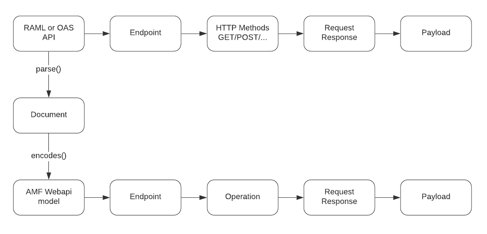

AMF can be used to validate incoming payloads to an API already deployed and running.
For example, consider a RAML API that declares:

- a `User` schema with `firstname`, `lastname` and `age` properties
- a `/users` endpoint with an HTTP POST method that requires a `User` object as body parameter

```yaml
#%RAML 1.0
title: API with Types
types:
  User:
    type: object
    properties:
      firstname: string
      lastname:  string
      age:       number
/users:
  post:
    body:
      application/json:
        type: User
```

How can you confirm that a given payload is a valid `User`? You can do that with AMF payload validation.
To do that, you first need to go through certain steps:

1. Get the AMF payload shape
2. Create a `PayloadValidator`
3. Validate payloads


## 1. Get the AMF payload model
When AMF parses an API:
- Returns a `Document` that encodes a `WebApi`, which is the AMF model of the original API
- Abstracts the HTTP methods to `Operation` objects



The [AMF Model Documentation](https://github.com/aml-org/amf/blob/develop/documentation/model.md#webapi) has more information
on each intermediate model, but at the end of the chain there is the **Payload shape** we want to use.

## 2. Create a PayloadValidator
The Payload shape (or schema) is a specific implementation of the [AnyShape](https://github.com/aml-org/amf/blob/develop/documentation/model.md#anyshape) class,
which implements the **`ValidatorAware`** interface:

```scala title="amf.client.model.domain.ValidatorAware.scala"
trait ValidatorAware {

  def payloadValidator(mediaType: String): ClientOption[PayloadValidator]

  def payloadValidator(mediaType: String, exec: BaseExecutionEnvironment): ClientOption[PayloadValidator]

  def payloadValidator(mediaType: String, env: Environment): ClientOption[PayloadValidator]

  def parameterValidator(mediaType: String): ClientOption[PayloadValidator]

  def parameterValidator(mediaType: String, exec: BaseExecutionEnvironment): ClientOption[PayloadValidator]

  def parameterValidator(mediaType: String, env: Environment): ClientOption[PayloadValidator]
}
```

This interface defines methods to create a `PayloadValidator` from an `AnyShape` given the `mediaType` and optionally the
`BaseExecutionEnvironment` or `Environment` objects.

There are two distinct payload validators:

- **`payloadValidator`**
    - Validates types, values and constraints in strict mode
- **`parameterValidator`**
    - A best-effort validation, fails only if there is no applicable schema
    - Used for validating query parameters, where different types may be sent as strings


## 3. Validate payloads
You can use the following methods of PayloadValidator to validate a payload:

- **`isValid(mediaType: String, payload: String): ClientFuture[Boolean]`**
    - Validates a payload given its media type in fail-fast mode
    - Stops execution when it encounters any violation
    - Used for checking payload validity
- **`validate(mediaType: String, payload: String): ClientFuture[ValidationReport]`**
    - Validates a payload given its media type and returns a `ValidationReport` Object containing detailed information about all errors found
- **`validate(payloadFragment: PayloadFragment): ClientFuture[ValidationReport]`**
    - Validates a payload from an [AMF PayloadFragment](https://github.com/aml-org/amf/blob/develop/documentation/model.md#payloadfragment)
- **`syncValidate(mediaType: String, payload: String): ValidationReport`**
    - Validates a payload synchronously
    - Returns the `ValidationReport` directly


### Code examples of payload validation
The following code examples validate the previously mentioned `User` schema with the payload validation methods:

import Tabs from '@theme/Tabs';
import TabItem from '@theme/TabItem';
import CodeGetter from "../../components/CodeGetter";

<Tabs
    groupId="languages"
    defaultValue="java"
    values={[
        {label: 'Java', value: 'java'},
        {label: 'JavaScript', value: 'js'}
    ]}
>

<TabItem value="java">
    <CodeGetter
        language='java'
        codeUrl='examples/new-doc/src/test/java/PayloadValidationTest.java'
    />
</TabItem>
<TabItem value="js">
    <CodeGetter
        language='js'
        codeUrl='examples/new-doc/src/test/js/payload-validation.test.js'
    />
</TabItem>
</Tabs>
