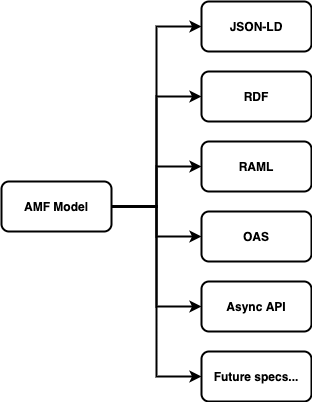

Emission is the process of exporting an AMF model to a specific format.
Any AMF model can be emitted as a standard JSON-LD or RDF graph.
In the case of the WebApi model in particular, it can also be exported to RAML, OAS and AsyncAPI (AMF intends to support additional specifications as they become available):

Each emission has limitations, as some elements may be unique to a specification and can't be represented in others.
You can find more technical information in the related documentation.
